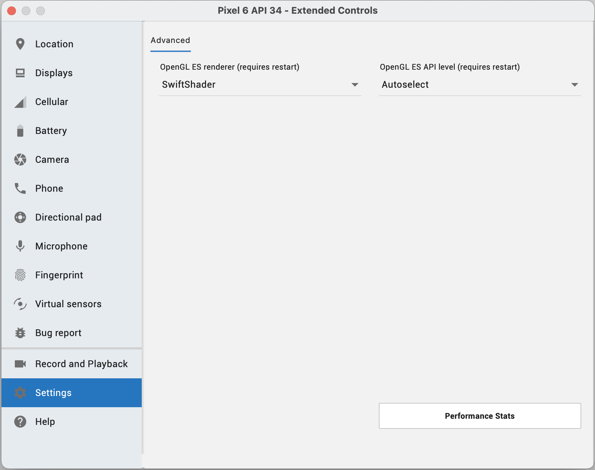

## Problem
If the code is working fine on Android real device but not working on Android Emulator. For example, getting the below exception:
``` bash
E/AndroidRuntime( 4487): FATAL EXCEPTION: GLThread 58
E/AndroidRuntime( 4487): Process: com.morbit.amap_flutter_example, PID: 4487
E/AndroidRuntime( 4487): java.lang.RuntimeException: createContext failed: EGL_SUCCESS
E/AndroidRuntime( 4487): 	at android.opengl.GLSurfaceView$EglHelper.throwEglException(GLSurfaceView.java:1223)
E/AndroidRuntime( 4487): 	at android.opengl.GLSurfaceView$EglHelper.throwEglException(GLSurfaceView.java:1214)
E/AndroidRuntime( 4487): 	at android.opengl.GLSurfaceView$EglHelper.start(GLSurfaceView.java:1064)
E/AndroidRuntime( 4487): 	at android.opengl.GLSurfaceView$GLThread.guardedRun(GLSurfaceView.java:1431)
E/AndroidRuntime( 4487): 	at android.opengl.GLSurfaceView$GLThread.run(GLSurfaceView.java:1272)

E/AndroidRuntime( 4487): 	at android.opengl.GLSurfaceView$GLThread.run(GLSurfaceView.java:1272)
E/AndroidRuntime( 4487): 	at android.opengl.GLSurfaceView$GLThread.run(GLSurfaceView.java:1272)
E/AndroidRuntime( 4487): 	at android.opengl.GLSurfaceView$GLThread.run(GLSurfaceView.java:1272)
E/AndroidRuntime( 4487): 	at android.opengl.GLSurfaceView$GLThread.run(GLSurfaceView.java:1272)
E/AndroidRuntime( 4487): 	at android.opengl.GLSurfaceView$GLThread.run(GLSurfaceView.java:1272)
E/AndroidRuntime( 4487): 	at android.opengl.GLSurfaceView$GLThread.run(GLSurfaceView.java:1272)
E/AndroidRuntime( 4487): 	at android.opengl.GLSurfaceView$GLThread.run(GLSurfaceView.java:1272)
E/AndroidRuntime( 4487): 	at android.opengl.GLSurfaceView$GLThread.run(GLSurfaceView.java:1272)
E/AndroidRuntime( 4487): 	at android.opengl.GLSurfaceView$GLThread.run(GLSurfaceView.java:1272)
E/AndroidRuntime( 4487): 	at android.opengl.GLSurfaceView$GLThread.run(GLSurfaceView.java:1272)
E/AndroidRuntime( 4487): 	at android.opengl.GLSurfaceView$GLThread.run(GLSurfaceView.java:1272)
E/AndroidRuntime( 4487): 	at android.opengl.GLSurfaceView$GLThread.run(GLSurfaceView.java:1272)
E/AndroidRuntime( 4487): 	at android.opengl.GLSurfaceView$GLThread.run(GLSurfaceView.java:1272)
E/AndroidRuntime( 4487): 	at android.opengl.GLSurfaceView$GLThread.run(GLSurfaceView.java:1272)

```


## Solution
Open the `Entended Controls` window of the Android Emulator, then open `Settings` section. Change `OpenGL ES renderer` from `Autodetect based on host (default)` to `SwiftShader`. Then, restart the Android Studio. After that my app began working perfectly.
 
Here is a screenshot for clarity:
