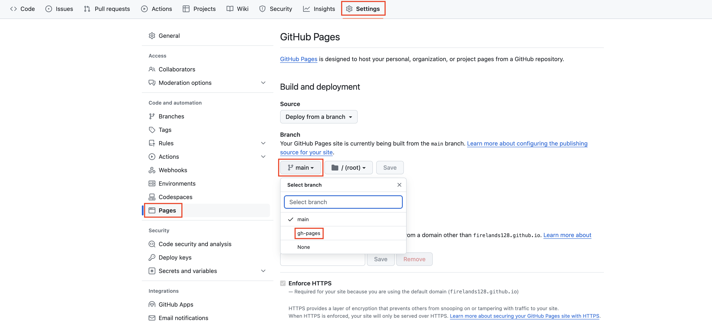
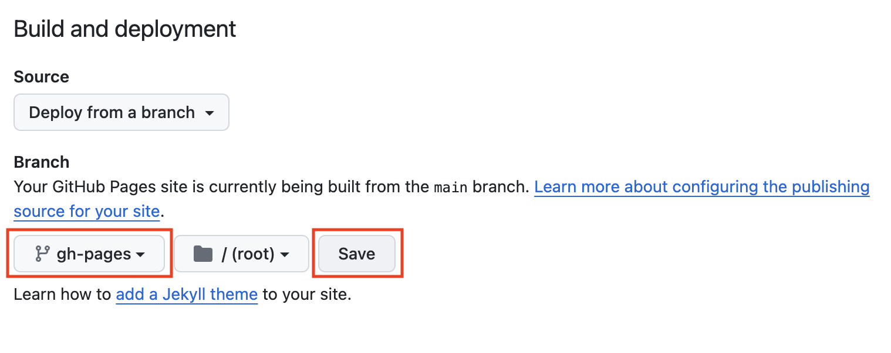

1. Add ```gh-pages.yml``` file in ```.github/workflows``` directory with following code:
```yml
name: GitHub Pages

on:
  push:
    branches:
      - main  # Set a branch name to trigger deployment

jobs:
  deploy:
    runs-on: ubuntu-22.04
    permissions:
      contents: write
    concurrency:
      group: ${{ github.workflow }}-${{ github.ref }}
    steps:
      - uses: actions/checkout@v3
        with:
          submodules: true  # Fetch Hugo themes (true OR recursive)
          fetch-depth: 0    # Fetch all history for .GitInfo and .Lastmod

      - name: Setup Hugo
        uses: peaceiris/actions-hugo@v2
        with:
          hugo-version: 'latest'

      - name: Build
        run: hugo --minify

      - name: Deploy
        uses: peaceiris/actions-gh-pages@v3
        # If you're changing the branch from main,
        # also change the `main` in `refs/heads/main`
        # below accordingly.
        if: github.ref == 'refs/heads/main'
        with:
          github_token: ${{ secrets.GITHUB_TOKEN }}
          publish_dir: ./public
```
​		You can see [details](https://github.com/peaceiris/actions-gh-pages) explained in ```actions-gh-pages``` repository.

2. Configure Github Pages ```branch``` in repository settings.
    
    Go to your repository ```Settings```, click ```Pages``` under ```Code and automation``` section, select branch ```gh-pages``` and click ```Save```.





3. Github Actions will rerun the workflow automatically. After that you can see you hugo website deployed successfully.
