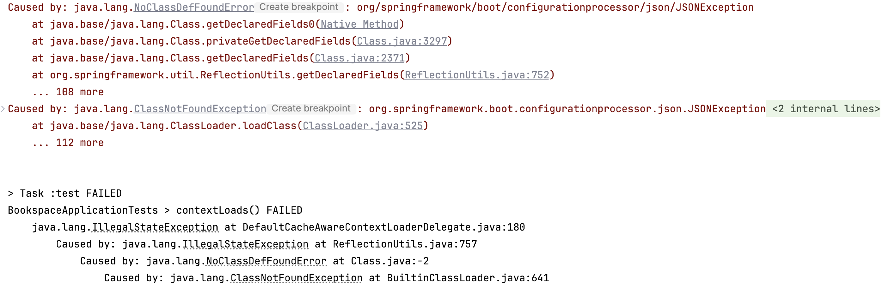

## Problem
If getting this JSONException like below:

You can try to check gradle dependencies whether if add ```spring-boot-configuration-processor``` dependency.

## Solution
Add the following dependency:
```gradle
implementation 'org.springframework.boot:spring-boot-configuration-processor'
```

## Reference
* https://stackoverflow.com/questions/73071773/how-to-fix-java-lang-classnotfoundexception-org-springframework-boot-configurat
