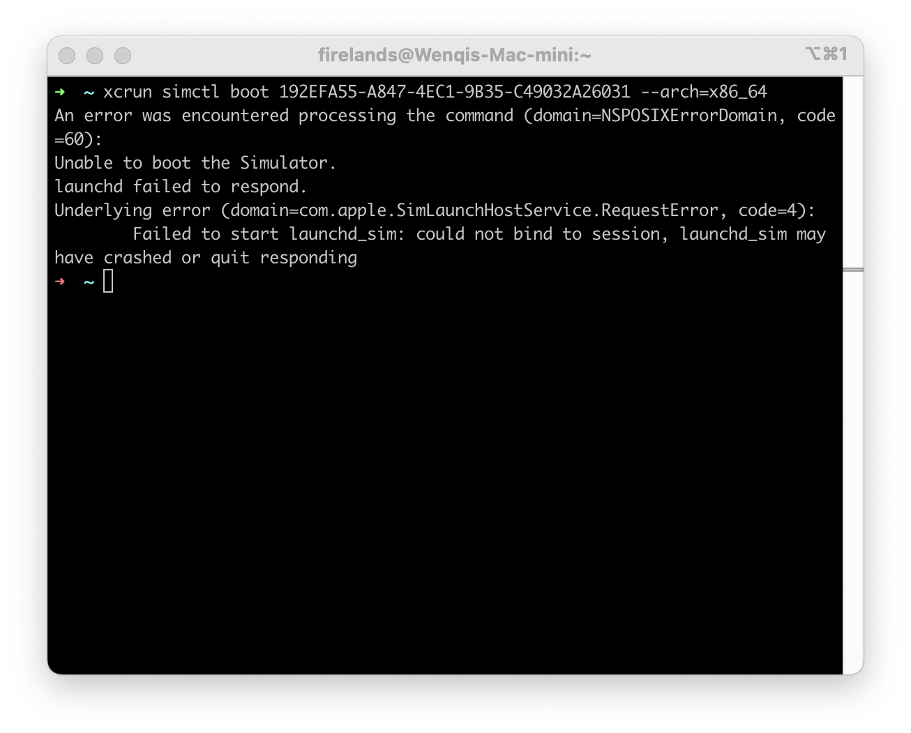
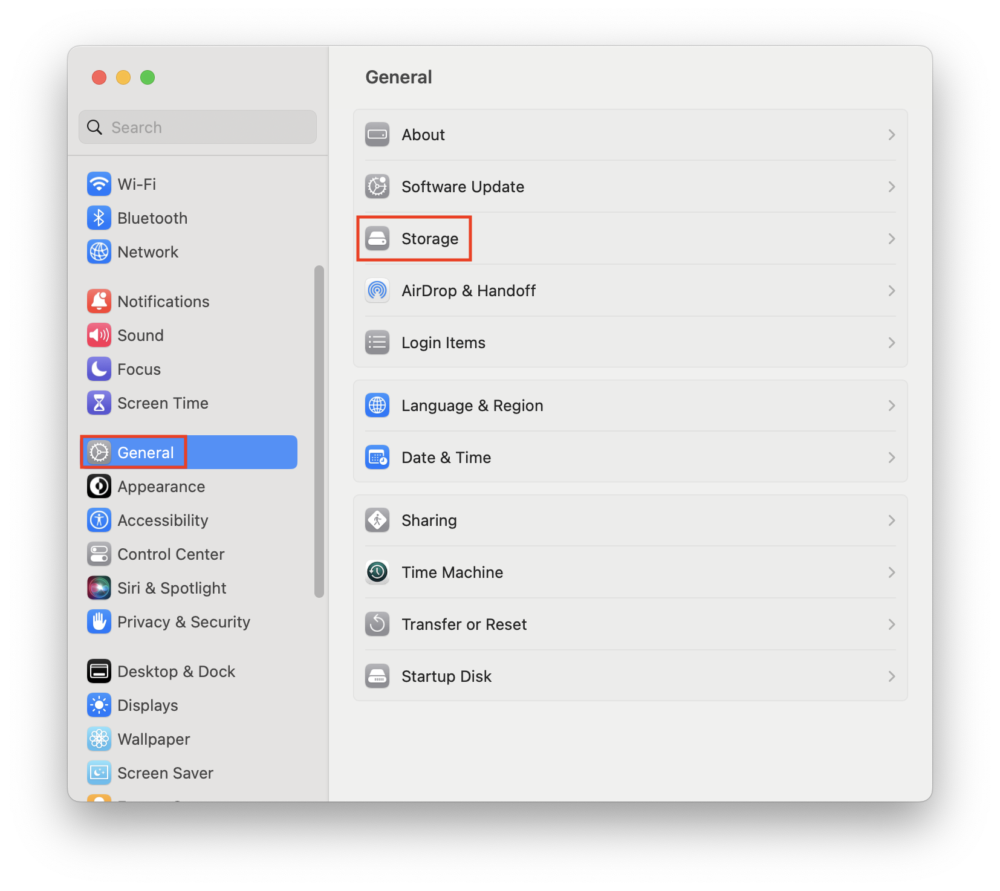
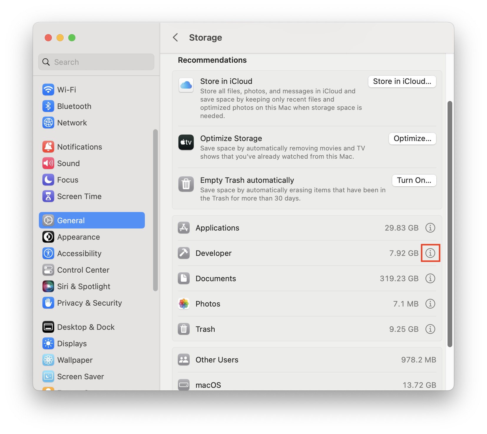

​		If you encounter the following exception when boot the iOS simulator:



​		Or:


​		You can try this```Mac --- > System Settings --- > Storage --- > Developer --- > Delete Xcode Caches```. And then restart the simulator, it may work fine.






