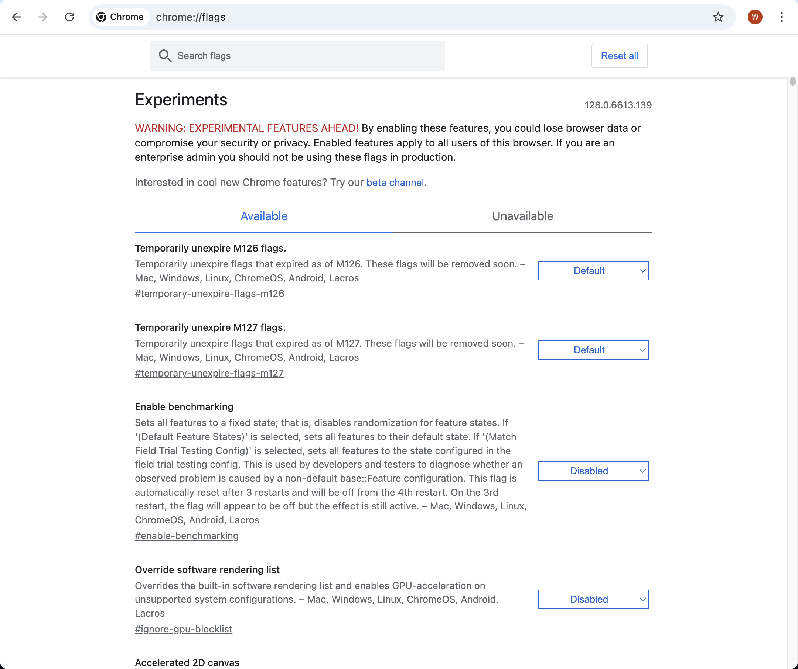
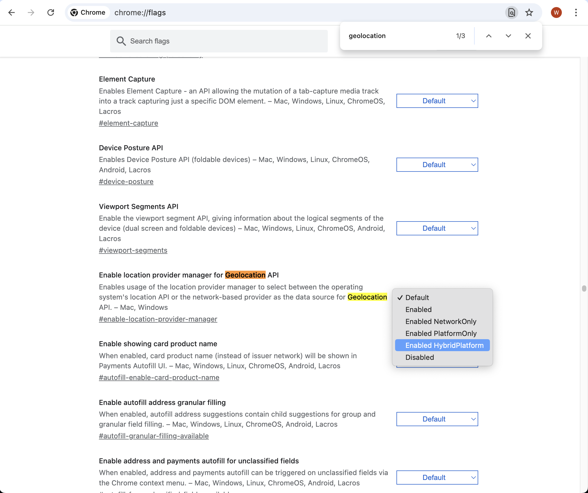
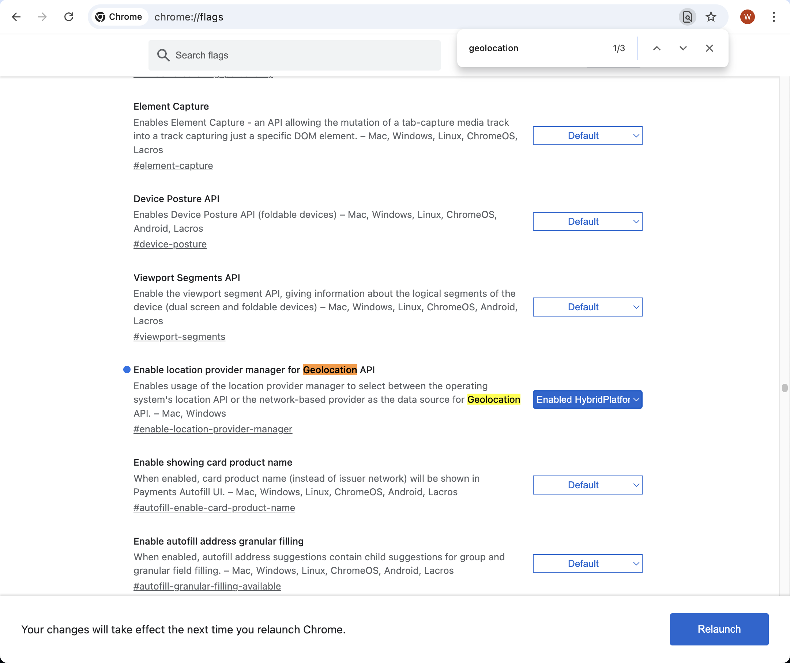

## Problem
If you cannot get correct geolocation result from map website on Google Chrome, it may be because geolocation didn't enable operation system location API.

## Solution
Enter ```chrome://flags``` in address bar. There would show some experimental features.



Search ```geolocation``` on this page. \
Next, change setting ```Enable location provider manager for Geolocation API``` value to ```Enabled HybirdPlatform```.



Last, relaunch the Google Chrome, by pressing ```Relaunch``` button.



After the Google Chrome restarted, geolocation would using platform api to location on map website.